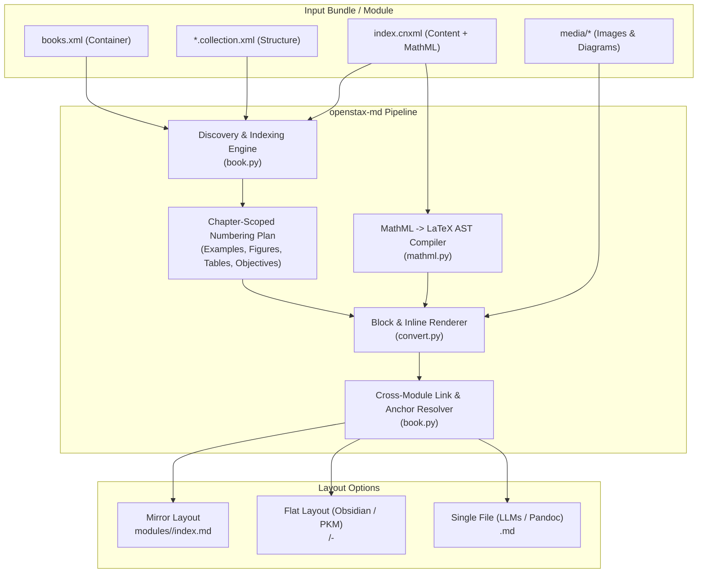

<div align="center">

<picture>
  
</picture>

<br/><br/>

[](https://github.com/michaelnavazhylau/openstax-md/actions)
-success)


[](https://github.com/astral-sh/ruff)
[](https://mypy-lang.org/)
[](https://opensource.org/licenses/MIT)


<p align="center">
  <strong>A high-fidelity compiler transforming OpenStax CNXML/COLLXML textbooks into GitHub Flavored Markdown with LaTeX math, publisher-accurate numbering, and cross-reference resolution.</strong>
</p>

</div>

---

## 📖 Overview

[OpenStax](https://openstax.org/) publishes world-class open-source textbooks encoded in **CNXML** (Connexions XML) and **COLLXML** (Collection XML) with embedded **MathML**. While CNXML provides rich pedagogical markup, converting it to Markdown has historically meant losing complex equations, dropping worked examples, breaking links, and losing textbook structure.

`openstax-md` is a ground-up Python compiler that solves this. It compiles full OpenStax textbook bundles (such as the 3-volume Calculus curriculum, containing 133 modules, ~47,500 MathML expressions, and 1,600+ figures) into pristine Markdown with **zero content loss**, valid LaTeX math, publisher-accurate numbering, and multiple layout targets (developer mirror, PKM/Obsidian vaults, or single-file LLM context windows).

---

## ⚡ The Breakthrough: Closing 28 Legacy Gaps

The original 2016 converter (`Ravenstine/cnxml2md`) was abandoned, fails to run on modern Node.js (`primordials is not defined`), stripped MathML into unreadable text, dropped worked examples, and omitted book structures.

Here is the measured comparison compiling **OpenStax Calculus Volume 1** (55 modules):

| Metric | Legacy JS Converter (2016) | `openstax-md` (Python) | Improvement |
|---|:---:|:---:|:---:|
| **Output Characters** | 860,270 | **1,736,675** | +101.8% content recovered |
| **Output Words** | 136,023 | **240,944** | +77.1% content recovered |
| **Math Expressions** | 56 (accidental `$`) | **19,844** | Complete MathML→LaTeX recovery |
| **LaTeX Commands** | 0 | **20,053** | Full formula typesetting |
| **Tables Preserved** | 0 | **148** | 100% GFM table reconstruction |
| **Figures Preserved** | 215 | **684** | Includes subfigures & admonitions |
| **Cross-References** | 208 (broken) | **1,305** | Relative file links + `<a id>` anchors |
| **Anchors Emitted** | 0 | **443** | Precise deep linking |
| **Missing Prose Words** | 2.71% dropped | **0.00%** | **100% prose preservation** |
| **KaTeX Parse Errors** | N/A (no math) | **0 errors (47k+ spans)** | Verified against KaTeX engine |

> For the comprehensive breakdown of all 28 identified gaps, root-cause analyses, and resolution details, see [`docs/gap-report.md`](docs/gap-report.md).

---

## 🏗️ Architecture



---

## ✨ Key Features

- **AST-Based MathML to LaTeX Compiler**:
  - Translates Presentation MathML elements into idiomatic LaTeX.
  - Handles fractions (`\frac`), nested sub/superscripts (`{x^2}^n`), radicals (`\sqrt[n]`), delimiters (`\left[ \right]`), piecewise functions (`\begin{cases}`), and matrices.
  - Maps 30+ Unicode mathematical operators, Greek letters, and multiline expressions.
  - Supports configurable delimiters: `dollar` (`$...$` / `$$...$$`), `bracket` (`\(...\)` / `\[...\]`), or `none`.
- **Publisher-Accurate Chapter Numbering**:
  - Automatically reconstructs OpenStax's chapter-scoped numbering scheme (`Example 1.1`, `Figure 1.2`, `Table 1.1`, `(1.1)`, objectives `1.1.1`).
  - Isolated module scopes prevent element ID collisions across multi-book bundles.
- **3 Flexible Output Layouts**:
  - `mirror`: Preserves the upstream module layout (`out/modules/<id>/index.md`).
  - `flat`: Flattens into numbered chapters (`out/<book>/<NN>-<title>.md`) tailored for Obsidian, Logseq, and PKM vaults.
  - `single`: Merges an entire textbook into a single Markdown file, ideal for feeding into LLM context windows or compiling to PDF with Pandoc.
- **Full Cross-Reference & Anchor Resolution**:
  - Inter-module links (`<link document="m1" target-id="fig1"/>`) are resolved to relative file paths with target `<a id="...">` anchors.
  - `--with-deps` flag transitively pulls in referenced modules during partial builds to ensure zero broken links.
- **Asset & Media Bundling**:
  - Relative image paths are rewritten per output file.
  - Modes: `link` (relative in-tree link), `copy` (copies all assets into `<out>/media/`), or `original` (keeps XML `src` attribute).
- **100% Prose Preservation Guarantee**:
  - Verified by an independent test harness checking every prose word from the source XML against the compiled output (0 words dropped across 297k+ words).
- **Dual Interface**:
  - Ergonomic CLI with JSON build reports and Jing RNG validation.
  - High-level Python library API for programmatic conversion.

---

## 🚀 Installation

`openstax-md` requires Python `>= 3.10`.

### 1. Global CLI Tool via `uv` (Recommended)

Install `openstax-md` directly from GitHub into an isolated environment using [Astral uv](https://docs.astral.sh/uv/concepts/tools/). The executable is immediately available anywhere in your terminal:

```bash
# Install globally as a standalone CLI tool
uv tool install git+https://github.com/michaelnavazhylau/openstax-md.git

# The `openstax-md` command is now available system-wide:
openstax-md search physics
openstax-md astronomy-2e -o build/astronomy
```

> **Tip:** You can also execute `openstax-md` ad-hoc without installing anything using `uvx`:
> ```bash
> uvx --from git+https://github.com/michaelnavazhylau/openstax-md.git openstax-md search python
> ```

To upgrade or remove:

```bash
uv tool upgrade openstax-md
uv tool uninstall openstax-md
```

### 2. From Source (Development)

```bash
# Clone the repository
git clone https://github.com/michaelnavazhylau/openstax-md.git
cd openstax-md

# Install dependencies and editable tool
uv sync
uv pip install -e .

# Or install your local clone as a uv tool:
uv tool install .
```

---

## 💻 CLI Usage

The CLI operates on local files **or** pulls remote textbooks directly from the OpenStax catalog using Docker-style semantics.

### 1. Docker-Style Remote Pulling & Auto-Fetch

You don't need to manually clone repositories. `openstax-md` bundles an offline index of all 89 OpenStax textbook volumes and performs instant blobless, sparse checkouts on demand:

```bash
# 🔍 Search the catalog for available textbooks
openstax-md search physics
openstax-md search python --json

# 📋 List all available books (filterable by discipline or language)
openstax-md list --category "Mathematics"
openstax-md list --lang es   # Spanish editions
openstax-md list --lang pl   # Polish editions

# 📥 Explicitly pull a textbook into local cache (~2-5 seconds, ~10MB)
openstax-md pull astronomy-2e
openstax-md pull calculus-volume-1
openstax-md pull osbooks-introduction-python-programming

# 🚀 Transparent on-demand compilation (like `docker run`):
# If the textbook isn't found locally, openstax-md pulls it automatically and compiles!
openstax-md astronomy-2e -o build/astronomy
openstax-md calculus-volume-1 --layout flat --media copy -o vault/calculus
```

### 2. Local File & Bundle Compilation

The CLI also accepts a local bundle root directory, a `*.collection.xml` file, a module directory, or a single `index.cnxml` file:

```bash
# Compile an entire local bundle (all volumes), mirroring the source layout
openstax-md osbooks-calculus-bundle -o build/calculus

# Compile one book into an Obsidian/Logseq-friendly flat vault with copied images
openstax-md osbooks-calculus-bundle --collection calculus-volume-1 \
    --layout flat --media copy -o vault/calculus

# Compile an entire book as a single Markdown file (for LLMs or Pandoc PDF export)
openstax-md osbooks-calculus-bundle --collection calculus-volume-1 \
    --layout single -o build/books

# Compile a single module with RNG schema validation and a JSON report
openstax-md osbooks-calculus-bundle/modules/m53477 \
    --validate --report build/report.json -o build/one
```

### CLI Command & Flag Reference

#### Commands

| Command | Usage | Description |
|---|---|---|
| `pull` | `openstax-md pull <target> [-c <dir>] [--media] [-f]` | Pull textbook into cache using blobless sparse checkout |
| `search` | `openstax-md search <query> [--category <cat>] [--lang <code>] [--json]` | Search OpenStax catalog for textbooks |
| `list` | `openstax-md list [--category <cat>] [--lang <code>] [--json]` | List textbooks in catalog |
| `compile` | `openstax-md [INPUT ...] [OPTIONS]` (default action) | Compile CNXML/COLLXML to Markdown (auto-pulls if remote slug) |

#### Compiler Flags

| Flag | Values | Default | Description |
|---|---|:---:|---|
| `-o`, `--out` | `<path>` | `build/<name>` | Output destination directory |
| `--layout` | `mirror`, `flat`, `single` | `mirror` | Directory layout: mirror source tree, flat chapter files, or single-file |
| `--media` | `link`, `copy`, `original` | `link` | Relative link into source tree, copy into `out/media/`, or keep verbatim |
| `--anchors` | `referenced`, `always`, `none` | `referenced` | Emit `<a id="...">` anchors for link targets, all IDs, or none |
| `--math` | `dollar`, `bracket`, `none` | `dollar` | Delimiter style: `$`/`$$`, `\(`/`\[`, or plain LaTeX |
| `--admonitions` | `bold`, `block`, `heading` | `bold` | Formatting style for examples, notes, and solutions |
| `--collection` | `<slug>` | – | Filter build to specific collection slug (repeatable) |
| `--module` | `<id>` | – | Filter build to specific module ID (repeatable) |
| `--with-deps` | flag | `false` | Transitively pull in referenced modules so cross-links stay intact |
| `--validate` | flag | `false` | Run `jing.jar` RNG validation (requires Java) |
| `--strict` | flag | `false` | Exit with non-zero status on warnings, missing media, or schema errors |
| `--report` | `<path>` | – | Write comprehensive JSON build metrics and statistics |
| `-c`, `--cache-dir` | `<path>` | `~/.cache/openstax-md` | Custom cache directory for remote checkouts |
| `-v`, `--version` | flag | – | Show program's version number and exit |

---

## 🐍 Python SDK & Embedding Guide

`openstax-md` can be embedded directly into other Python applications, data pipelines, and RAG/LLM ingestion systems. It ships with PEP 561 typing markers (`py.typed`) for full IDE autocomplete and MyPy/Pyright static type checking.

### Installing into an External Project

```bash
# Add to your project using uv
uv add git+https://github.com/michaelnavazhylau/openstax-md.git

# Or install using standard pip
pip install git+https://github.com/michaelnavazhylau/openstax-md.git
```

Or declare it directly in your application's `pyproject.toml`:

```toml
[project]
dependencies = [
    "openstax-md @ git+https://github.com/michaelnavazhylau/openstax-md.git",
]
```

### SDK Usage Examples

Import the high-level `openstax_md` package:

```python
import openstax_md as osm

# 1. Search the catalog and pull books programmatically
results = osm.search("calculus")
for book in results:
    print(f"{book['slug']:25} | {book['title']:35} | {book['category']}")

# Explicit pull (returns local path and collection slug)
repo_path, slug = osm.pull("astronomy-2e")
print(f"Cached at {repo_path}")

# 2. Transparent remote bundle discovery & compilation
# Automatically resolves and pulls if not present locally!
bundle = osm.Bundle.discover("astronomy-2e")
builder = osm.Builder(
    bundle,
    out_dir="build/astronomy",
    options=osm.RenderOptions(math="dollar", media="link"),
    layout="flat",  # "mirror", "flat", or "single"
)
report = builder.build()
print(f"Compiled {report.modules} modules, {report.stats['math']} equations.")

# 3. Convert MathML string to LaTeX
latex = osm.convert_mathml("<m:math><m:msup><m:mi>x</m:mi><m:mn>2</m:mn></m:msup></m:math>")
print(latex)
# => "$x^{2}$"

# 4. Convert MathML with display delimiters
display_latex = osm.convert_mathml(
    "<m:math><m:mfrac><m:mn>1</m:mn><m:mn>2</m:mn></m:mfrac></m:math>", display=True
)
print(display_latex)
# => "$$\n\\frac{1}{2}\n$$"

# 5. Convert CNXML string or file directly to Markdown (for RAG / ingestion pipelines)
xml = """
<document xmlns="http://cnx.rice.edu/cnxml" xmlns:m="http://www.w3.org/1998/Math/MathML">
  <title>Derivatives</title>
  <content>
    <para>The derivative of <m:math><m:msup><m:mi>x</m:mi><m:mn>2</m:mn></m:msup></m:math> is <m:math><m:mrow><m:mn>2</m:mn><m:mi>x</m:mi></m:mrow></m:math>.</para>
  </content>
</document>
"""
markdown = osm.convert_cnxml(xml)
print(markdown)
```

---

## 🔬 Independent Verification & Quality Benchmarks

Unit tests only test what developers anticipate. To guarantee production-grade fidelity, `openstax-md` includes **four independent validation checkers** that share no code with the converter:

| Checker | Validation Goal | Measured Result |
|---|---|:---:|
| [`scripts/check_completeness.py`](scripts/check_completeness.py) | Verifies every source prose word appears in the output | **0 of 297,986 words missing (0.00%)** |
| [`scripts/validate_latex.js`](scripts/validate_latex.js) | Parses every emitted formula with KaTeX (the engine used by openstax.org) | **47,478 formulas parsed: 0 errors** |
| [`scripts/verify_output.py`](scripts/verify_output.py) | Confirms no leftover XML tags, balanced `$` delimiters, and that all 3,351 links/media resolve | **0 broken links, 0 leftover tags** |
| [`scripts/compare_with_openstax.py`](scripts/compare_with_openstax.py) | Compares generated headings, objectives, and numbering against live openstax.org pages | **34 sections across all 3 volumes: 0 mismatches** (coverage ≥ 99.2%) |

### Full-Bundle Benchmark (Calculus Volumes 1, 2, and 3)

```text
$ openstax-md osbooks-calculus-bundle -o build/calculus --report build/report.json --validate
openstax-md: 133 modules, 137 files, 47,523 math expressions, 1,631 links resolved, 1,617 images -> build/calculus
report.json: words=612,562, unhandled_elements={}, missing_media=[], warnings=[], validation_errors=[]

$ python scripts/verify_output.py build/calculus
files: 137 | links/images checked: 3,351 | anchors emitted: 1,113 | problems: 0

$ python scripts/check_completeness.py osbooks-calculus-bundle build/calculus
modules: 133 | source prose words: 297,986 | words absent from output: 0 (0.00%)

$ node scripts/validate_latex.js build/calculus
files: 137 | math spans parsed by KaTeX: 47,478 | parse errors: 0
```

### 🏆 Full-Catalog Battle Test (87 Volumes Across 54 Repositories)

To guarantee that `openstax-md` functions reliably across every academic discipline, style sheet, and XML structure published by OpenStax, we built an automated sparse-checkout battle test harness ([`scripts/bulk_test.py`](scripts/bulk_test.py)) integrated directly into [GitHub Actions CI](https://github.com/michaelnavazhylau/openstax-md/actions).

The harness cloned and compiled **all 54 OpenStax content repositories** containing **87 distinct textbook volumes**:

| Academic Discipline | Repositories | Textbooks / Volumes | Language | Modules | Formulas | Pass Rate | Unmapped Elements |
|---|:---:|:---:|:---:|:---:|:---:|:---:|:---:|
| **Mathematics** | 7 | 15 | `en` | 1,987 | 13,858 | **100%** (15/15) | **0** (100% mapped) |
| **Physical Sciences** | 6 | 11 | `en` | 1,793 | 14,484 | **100%** (11/11) | **0** (100% mapped) |
| **Life Sciences & Healthcare** | 5 | 9 | `en` | 1,517 | 180 | **100%** (9/9) | **0** (100% mapped) |
| **Business & Economics** | 10 | 18 | `en` | 1,578 | 1,173 | **100%** (18/18) | **0** (100% mapped) |
| **Social Sciences & Humanities** | 13 | 16 | `en` | 1,845 | 4 | **100%** (16/16) | **0** (100% mapped) |
| **Computer Science & Tech** | 4 | 4 | `en` | 275 | 282 | **100%** (4/4) | **0** (100% mapped) |
| **Spanish Editions (`es`)** | 5 | 9 | `es` | 895 | 11,949 | **100%** (9/9) | **0** (100% mapped) |
| **Polish Editions (`pl`)** | 4 | 6 | `pl` | 603 | 4,126 | **100%** (6/6) | **0** (100% mapped) |
| **Grand Total** | **54** | **87 volumes** | `en`/`es`/`pl` | **11,130** | **46,056** | **100.0% (87/87)** | **0 (100% mapped)** |

```text
$ python scripts/bulk_test.py --all --workers 6
Starting battle-test across 54 repositories with 6 workers...
[01/54] osbooks-calculus-bundle             -> 3/3 books passed (4,681 formulas)
[02/54] osbooks-astronomy                   -> 1/1 books passed (199 modules)
[03/54] osbooks-introduction-python-programming -> 1/1 books passed (115 modules)
[04/54] osbooks-principles-economics-bundle -> 5/5 books passed (603 modules)
[05/54] osbooks-university-physics-bundle   -> 3/3 books passed (3,641 formulas)
[06/54] osbooks-fizyka-bundle               -> 3/3 books passed (3,800 formulas)
[07/54] osbooks-calculo-bundle              -> 3/3 books passed (4,678 formulas)
...
[54/54] osbooks-life-liberty-and-pursuit-happiness -> 1/1 books passed (532 modules)

Battle Test Summary: 87/87 books passed in 53.4s.
Total Modules: 11,130 | Math Formulas: 46,056 | Links Resolved: 66,642 | Unmapped Tags: 0
```

---

## 🛠️ Development & Testing

A complete [`Makefile`](Makefile) is provided for common development tasks:

```bash
make test             # Run fast unit test suite (78 tests, < 0.5s)
make test-all         # Run all tests, including full bundle integration
make battle-test      # Fast multi-discipline battle test (8 disciplines, ~9s)
make battle-test-all  # Complete 87-volume catalog battle test (~50s)
make lint             # Run ruff check
make format           # Format code with ruff
make typecheck        # Run mypy strict type checks
make check            # Run lint, typecheck, format check, and tests
make build            # Build wheel and sdist distributions
```

---

## 📄 License

This project is licensed under the **MIT License**. See the [`LICENSE`](LICENSE) file for details.

The OpenStax textbooks used for test verification are licensed under [CC BY-NC-SA 4.0](https://creativecommons.org/licenses/by-nc-sa/4.0/) by Rice University.
